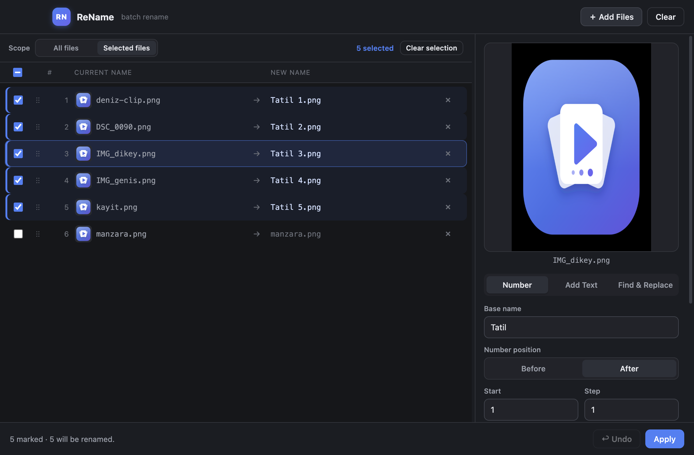

# ReName — batch rename photos & videos on macOS and Windows

ReName is a small, fast desktop app for **renaming many photos and videos at once**.
Give your files clean, sequential names (`Holiday 001`, `Holiday 002`, …), add a prefix
or suffix, or find-and-replace part of every name — and see exactly what will change in a
**live preview** before anything is written to disk.

It is meant to be the simple, friendly version of macOS Finder's "Rename" feature, working
the same way on **macOS and Windows**, with a few extras: a built‑in image/video preview
(including the first frames of a video), drag‑to‑reorder, per‑file manual editing, and
selective renaming.



## What it does

- **Bulk rename** any set of photos and videos in one go.
- **Sequential numbering** — `Base 001`, `Base 002`, … with a chosen start number, step,
  zero‑padding, separator, and number position (before/after the name). Ascending or
  descending.
- **Add text** — put a prefix at the start and/or a suffix at the end of every name.
- **Find & replace** — change a part of every file name (optionally case‑sensitive, and
  optionally including the extension).
- **Keep the existing order** — sort by name (natural order, so `img2` comes before
  `img10`), date created, date modified, size, or drag the rows into a manual order.
  Numbers follow that order; the order on disk is preserved.
- **Live preview** — every file shows `old name → new name` as you type. Conflicts and
  invalid names are flagged in red and can't be applied by accident.
- **Built‑in viewer** — click a file to preview it. Images and videos are shown at their
  real aspect ratio. For videos you can loop the first 3 seconds (Space) or the whole clip
  (Shift+Space), with a mute toggle. Drag the divider to make the viewer bigger.
- **Selective renaming** — switch the scope to *Selected files* and mark exactly which
  files to rename with checkboxes, `Ctrl/Cmd+click`, or `Shift+click` for a range.
- **Manual editing** — double‑click any new name to type a custom one for that single file.
- **Undo** — revert the last rename with one click (`Cmd/Ctrl+Z`).
- **Safe by design** — renaming is done in two passes, so even swapping names between two
  files (`a ↔ b`) never loses data; on any error the whole batch is rolled back.
- **Three languages** — English, Türkçe, and العربية (with right‑to‑left layout), switchable
  from the Language menu.

## Why ReName

If you have ever needed to:

- number a folder of holiday photos in order,
- give a batch of screen recordings or clips tidy, sortable names,
- add a date prefix to scanned documents,
- or fix one wrong word across hundreds of file names,

…then ReName does exactly that, without a learning curve and without touching anything you
didn't select.

## Privacy & permissions

ReName works **fully offline**. It only ever touches the files **you** pick (through the
file dialog or by dragging them in), so it doesn't need broad disk permissions and your
files never leave your computer. There is no account, no tracking, and no network access.

## Install

Download the latest build from the [Releases](../../releases/latest) page.

### macOS

1. Open the `.dmg` and drag **ReName** into your **Applications** folder.
2. Launch it from Applications — it just opens. The macOS builds are **signed with an Apple
   Developer ID and notarized by Apple**, so there is no "unidentified developer" warning.

> ReName installs into Applications and appears in Launchpad and the Dock with its own icon.

### Windows

1. Run the `ReName Setup ...exe` installer (no admin rights required — it installs per‑user).
2. It creates a **Desktop shortcut** and a **Start Menu** entry with the ReName icon.

There is also a portable `.exe` if you prefer not to install.

## Usage

1. **Add files** — drag photos/videos onto the window, or click **Add Files** (`Cmd/Ctrl+O`).
2. **Choose a mode** — *Number*, *Add Text*, or *Find & Replace*.
3. **Set the order** — sort by name/date/size, or drag rows to reorder.
4. *(optional)* Switch scope to **Selected files** and mark just the ones you want.
5. Check the **live preview**, then click **Apply** (`Cmd/Ctrl+Enter`).

### Keyboard shortcuts

| Action | Shortcut |
| --- | --- |
| Add files | `Cmd/Ctrl + O` |
| Apply | `Cmd/Ctrl + Return` |
| Undo | `Cmd/Ctrl + Z` |
| Select all | `Cmd/Ctrl + A` |
| Deselect all | `Cmd/Ctrl + D` |
| Play / pause preview | `Space` |
| Loop the whole video | `Shift + Space` |
| Mark one / a range | `Cmd/Ctrl + click` / `Shift + click` |

## Build from source

Requires [Node.js](https://nodejs.org/) 18+.

```bash
git clone <this-repo-url>
cd ReName
npm install        # installs Electron + electron-builder
npm start          # run the app
npm test           # run the unit & filesystem tests

npm run dist:mac   # build macOS .dmg + .zip (arm64 + x64) into release/
npm run dist:win   # build Windows installer + portable .exe (run on Windows)
```

> Building the Windows installer is best done on Windows (or CI). Building it from macOS
> requires Wine.

### Code signing

The macOS builds are **signed with an Apple Developer ID and notarized by Apple**, so they
launch without Gatekeeper warnings. Windows builds are currently unsigned (a code‑signing
certificate would remove the SmartScreen "unknown publisher" prompt).

## Tech

Built with [Electron](https://www.electronjs.org/). The core renaming logic and the
filesystem operations are covered by tests (`npm test`). Thumbnails and video previews use
the operating system's own services (QuickLook on macOS, the Shell on Windows), so no extra
tools like FFmpeg are required.

## License

ReName is released under the **[PolyForm Noncommercial License 1.0.0](LICENSE)**.
You are free to use it for any **personal or other noncommercial** purpose. **Commercial use
is not permitted** under this license — contact Pekdemir Labs for commercial licensing.

© 2026 Pekdemir Labs.
